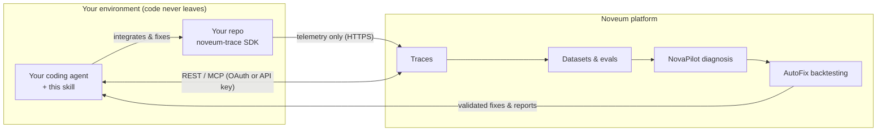
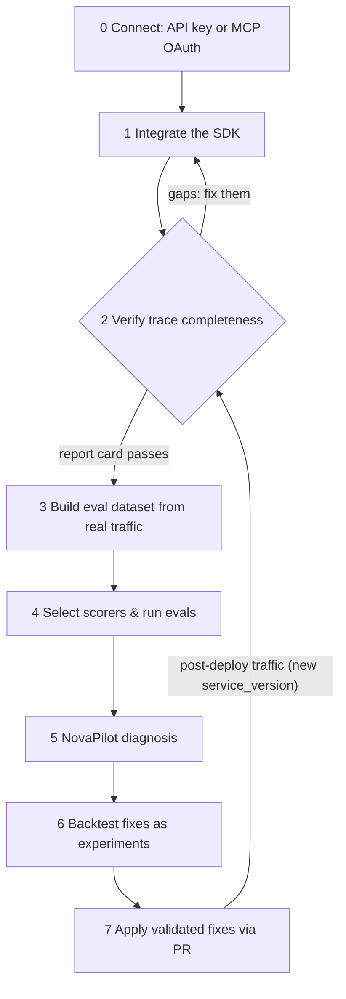

# Noveum Agent Skill — the AI Reliability & QA Engineer

The official [Agent Skill](https://platform.claude.com/docs/en/agents-and-tools/agent-skills/overview)
for [Noveum.ai](https://noveum.ai) — Noveum's **AI reliability & QA engineer**, packaged so
your coding agent can run the whole loop **inside your own environment**: instrument →
verify → evaluate → diagnose → fix → verify. It gives the agent everything it needs to set
up and operate Noveum **end to end**, and your code never leaves your machines.

Install it from [ClawHub](https://clawhub.ai/skills/noveum-ai) (`clawhub install noveum-ai`) or
vendor it straight from this repo (below).



The skill walks the agent through an acceptance-gated journey — it cannot declare a step
done until the platform confirms it:



Works with Claude Code, Claude (Enterprise/Team skills), the Claude Agent SDK, and any
agent that reads `SKILL.md`-style instructions.

## Data flow (for your security review)

**Your code never leaves your environment.** The `noveum-ai` skill runs inside *your* agent
with *your* credentials. The only data it sends to Noveum is telemetry (traces/spans) emitted
by the `noveum-trace` SDK over HTTPS with your org-scoped API key — the same data flow you
opt into by using the SDK at all. The skill contains no telemetry of its own, no external
dependencies, and two small stdlib-only Python scripts you can read in one sitting
(`noveum-ai/scripts/`). The API key is only ever read from the `NOVEUM_API_KEY` environment
variable.

This telemetry-only guarantee is specific to `noveum-ai`. The standalone `claude-skills/`
(below) are separate tools with their own data-transfer behavior — notably `noveum-dataset`
can **upload** dataset items, scorer results, and audio, and the NovaSynth skills fetch
transcripts and scores. Review each before use.

## Install

**Claude Code (project-level, recommended for teams — reviewable in your own PR):**

```bash
git clone https://github.com/Noveum/noveum-skill /tmp/noveum-skill
mkdir -p .claude/skills
cp -r /tmp/noveum-skill/noveum-ai .claude/skills/noveum-ai
```

**Claude Code (personal):** copy `noveum-ai/` to `~/.claude/skills/noveum-ai`.

**Claude Enterprise/Team:** an admin can upload the `noveum-ai/` folder as an organization
skill so every seat gets it with zero setup.

**Any other agent (Cursor, Codex, Copilot, …):** point it at
[`noveum-ai/SKILL.md`](noveum-ai/SKILL.md), or use the same instructions rendered at
[noveum.ai/agents.md](https://noveum.ai/agents.md).

Then just ask your agent: *"Integrate Noveum into this repo and verify traces are
flowing."*

## Connecting: two auth modes

- **MCP over OAuth 2.1** — interactive clients (Cursor, Claude & Claude Code, VS Code,
  ChatGPT, Windsurf, Cline, Zed, Goose) add just `https://noveum.ai/api/mcp` and get a
  sign-in + consent screen. No key handling at all.
- **Bearer API key** — headless agents, CI, and plain REST use
  `Authorization: Bearer $NOVEUM_API_KEY` against the same endpoints.

Details, decision guide, and `mcp.json` templates:
[`noveum-ai/references/getting-connected.md`](noveum-ai/references/getting-connected.md).

## What's inside

```
noveum-ai/
├── SKILL.md                       # the journey: connect + 7 steps, acceptance-gated
├── references/                    # loaded on demand (progressive disclosure)
│   ├── getting-connected.md       # accounts, keys, REST auth, MCP OAuth + API-key modes
│   ├── integrate-langchain.md     #   + crewai, livekit, pipecat, openai-manual
│   ├── verify-traces.md           # the completeness report card (step-1 gate)
│   ├── setup-evals.md             # datasets → ETL → scorers → eval runs (real traffic)
│   ├── novasynth-generate-run.md  # step-3 synthetic branch: generate + run NovaSynth calls
│   ├── novasynth-audit.md         # validate scenarios + audit calls & scorer verdicts
│   ├── diagnose-novapilot.md      # diagnosis reports
│   ├── novapilot-audit.md         # verify a report before acting on it
│   ├── experiments-autofix.md     # backtested fixes & experiments
│   ├── apply-fixes.md             # fix → repo edit → PR → verify
│   ├── api-reference.md           # endpoints, polling contract, credits
│   └── troubleshooting.md
├── scripts/
│   ├── send_test_trace.py         # prove connectivity with one known-good trace
│   ├── check_integration.py       # the trace-completeness report card
│   └── fetch_to_file.py           # stream large payloads to disk (context safety)
└── assets/
    └── mcp.json.template
```

Also at the repo root: **`claude-skills/`** — standalone, à-la-carte Claude Code skills for
Noveum (the NovaSynth capabilities above as individual skills, plus `noveum-dataset` and the
internal-only `novaeval-scorer`). See [`claude-skills/README.md`](claude-skills/README.md).

## Quality & provenance

- Attribute vocabulary and field-gap warnings validated against production Noveum
  integrations (LangChain, LiveKit, Pipecat, manual SDK deployments).
- Endpoint shapes and query parameters live-tested against the production API.
- `evals/scenarios.json` holds the test scenarios each release is checked against; CI
  validates frontmatter, link integrity, script syntax on a Python 3.9 floor, and the
  stdlib-only rule.

## Published on ClawHub

The skill is published to [ClawHub](https://clawhub.ai) under
[**@noveum-ai**](https://clawhub.ai/creators/noveum-ai). Install into any OpenClaw-compatible
agent with:

```bash
clawhub install noveum-ai
```

**Auto-sync:** publishing a GitHub Release here republishes the skill to ClawHub
automatically, via `.github/workflows/clawhub-publish.yml` (which calls the official
[`openclaw/clawhub` reusable workflow](https://docs.openclaw.ai/clawhub/) with
`owner: noveum-ai`). Manual runs default to a dry-run preview. The only setup is a repo
secret `CLAWHUB_TOKEN` (a ClawHub token for a publisher with access to `@noveum-ai`).

## Versioning & updates

Semver via git tags + [CHANGELOG.md](CHANGELOG.md). The skill keeps durable procedures
local and fetches volatile detail (exact API schemas) from live surfaces at run time, so
a vendored copy ages gracefully — but do pull updates occasionally.

## Requirements

- A Noveum account, API key, and org slug (dashboard → Settings → API Keys)
- Python ≥ 3.9 in the target repo for the SDK (`pip install noveum-trace`)
- No dependencies for the skill's own scripts (stdlib only)

## License

MIT — see [LICENSE](LICENSE).
