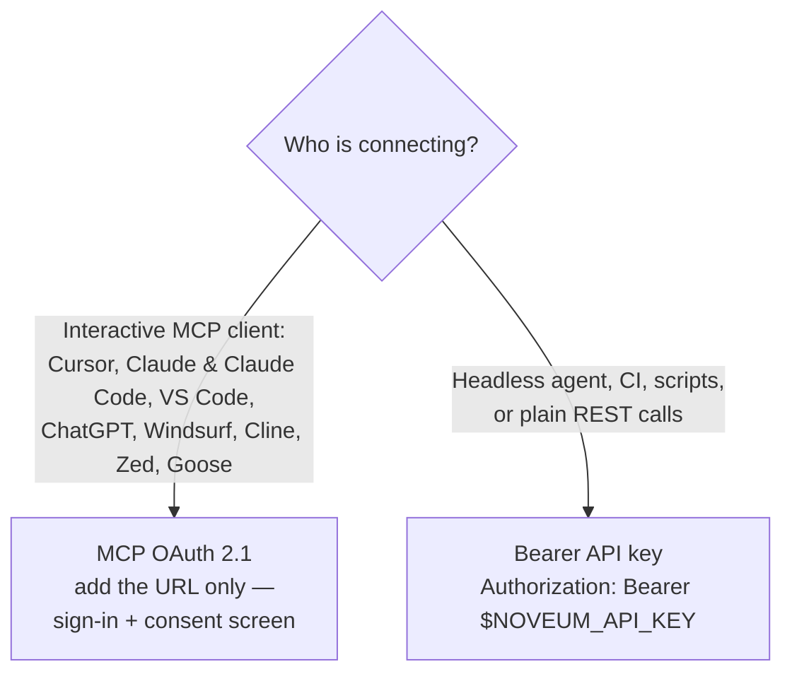

# Connect to Noveum (accounts, API keys, REST, MCP)

Everything about establishing the connection — before any code is written.

## Contents
- What you need from the human
- Choosing the auth mode (diagram)
- REST auth (Bearer header)
- MCP: OAuth mode (URL-only clients)
- MCP: API-key mode (headless)
- MCP usage rules + local variant
- Verifying the connection

## What you need from the human (agents must not do these)

| Item | Where the user gets it |
|---|---|
| Account + organization | https://noveum.ai signup; org slug is in the dashboard URL |
| API key (`nv_…`) | Dashboard → Settings → **API Keys** (or the onboarding starter key) |
| Project name | Their choice — projects auto-create on first trace |

The key is org-scoped: it identifies the organization on every call. Store it only in
the `NOVEUM_API_KEY` environment variable.

## Choosing the auth mode



Both modes hit the same endpoints with the same permissions model (org RBAC applies on
top of either).

## REST auth (Bearer header)

Every REST request:

```
GET https://api.noveum.ai/api/v1/status
Authorization: Bearer $NOVEUM_API_KEY
```

- Base URL `https://api.noveum.ai/api` (self-hosted deployments differ; the SDK reads
  `NOVEUM_ENDPOINT`).
- The org is inferred from the key — do not send org headers with API-key auth.

## MCP: OAuth mode (URL-only clients — recommended for interactive use)

Add just the endpoint — no key, no OAuth-app setup:

```
https://noveum.ai/api/mcp        (streamable HTTP)
```

The client discovers OAuth automatically (401 + `WWW-Authenticate` →
`/.well-known/oauth-protected-resource`), registers itself via dynamic client
registration, and opens a Noveum sign-in + consent screen (authorization code + PKCE).

- The token is bound to **one organization**, chosen at consent. Reconnect to switch orgs.
- Scopes chosen at consent — `noveum.read`, `noveum.write`, `noveum.execute` — only
  narrow what the client can do; they never grant beyond the user's org role.
- Revoke anytime from the Noveum dashboard's connected-apps settings.

## MCP: API-key mode (headless agents, CI)

Same server, same Bearer key as REST:

```bash
claude mcp add --transport http noveum https://noveum.ai/api/mcp \
  --header "Authorization: Bearer ${NOVEUM_API_KEY}"
```

Generic `mcp.json` (Cursor and most clients — see `assets/mcp.json.template`):

```json
{ "mcpServers": { "noveum": {
    "url": "https://noveum.ai/api/mcp",
    "headers": { "Authorization": "Bearer ${NOVEUM_API_KEY}" } } } }
```

## MCP usage rules + local variant

The server exposes ~60 tools (generated from the live API), 16 read-first `noveum://`
resources, and 20 workflow prompts.

- Reference tools fully qualified (`noveum:<tool_name>`) when several MCP servers are
  connected.
- Read `noveum://projects`, `noveum://filter-values`, `noveum://org-status` before
  querying traces — never invent ids or slugs.
- Long-running work is queued: kick off, then poll to a terminal status
  ([api-reference.md](api-reference.md) has the cadence table).
- **Large payloads:** `@noveum/mcp-local` (npm) is a stdio variant that streams big
  responses (full datasets, reports) to local files and returns
  `{ savedTo, bytes, sha256 }` — prefer it for dataset items and full reports when
  available.

## Verifying the connection

REST: `GET /v1/status` returns org health, plan, usage, and rate-limit state — a 200
with a `usage` block proves the key works. MCP: read `noveum://org-status` (same data).
Then prove ingest with `python scripts/send_test_trace.py` (one known-good trace).
